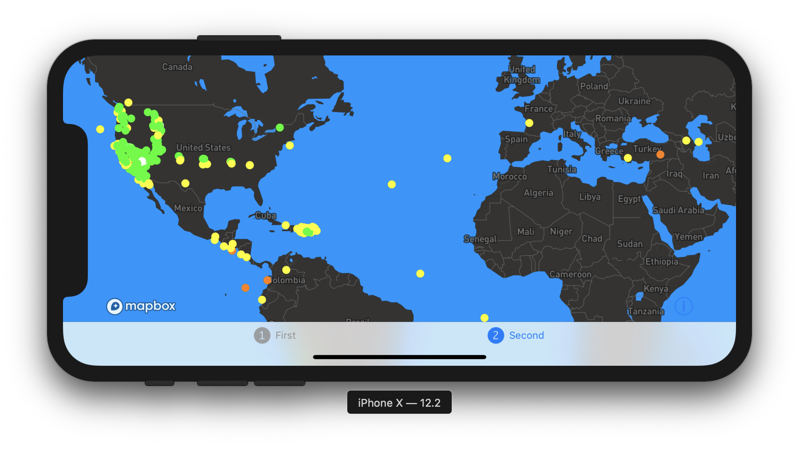

# Maptime Mobile Mapping Workshop - iOS platform

## Installation instructions

In order to spend less time configuring a new project and more time building, the iOS project in this folder contains an app already set up with the Mapbox Maps SDK.

You will need to complete a couple of more steps to get it running:

1. Open the `maptime-mobile/maptime-mobile.xcodeproj` file, which will open the project in Xcode.
2. Navigate to the `Info.plist` file using the file navigator on the left. This file contains key/value pairs that your project uses to configure internal app settings and user preferences. 
3. Find the `MGLMapboxAccessToken` key, and enter your access token as a string value to the right of it. You can find your access token at https://account.mapbox.com/access-tokens/.
4. Press the ▶️ button on the top left corner to run the project. You should see an iPhone simulator start up and then display a basic map. If you don't see a map but your app runs, make sure you entered your access token correctly.

## Task 2:
### Understanding the basics of the Mapbox Maps SDKs for iOS

For this task, you will be working in the `FirstViewController.swift` file. Your goal is to:
- Understand how to set a map's style
- Set the default center coordinate and zoom level of the map
- Add a basic marker with a callout

Comments are prefaced with a double forward slash (`//`), and will guide you through the exercises. If you want to see the results of each change you make to your code, you will need to re-run the application by pressing the ▶️ button on the top left corner of Xcode to run the project.

## Task 3: 
### Advanced topics within the Mapbox Maps SDKs for iOS

For this task, you will be working in the `SecondViewController.swift` file. Your goal is to:
- Change the color of country borders
- Add data from an external API
- Style data based off of a certain attribute value

Comments are prefaced with a double forward slash (`//`), and will guide you through the exercises. If you want to see the results of each change you make to your code, you will need to re-run the application by pressing the ▶️ button on the top left corner of Xcode to run the project.

### Useful references & additional resources:
- API documentation for the Mapbox Maps SDK: https://docs.mapbox.com/ios/api/maps/
- Maps SDK for iOS overview: https://docs.mapbox.com/ios/maps/overview
- iOS examples: https://docs.mapbox.com/ios/maps/examples/
- Tutorials: https://docs.mapbox.com/help/tutorials/
- The Swift Programming language guide: https://docs.swift.org/swift-book/LanguageGuide/TheBasics.html
- The Swift Standard Library: https://developer.apple.com/documentation/swift/swift_standard_library
- Raywenderlich.com (excellent iOS tutorials): https://www.raywenderlich.com/ios

